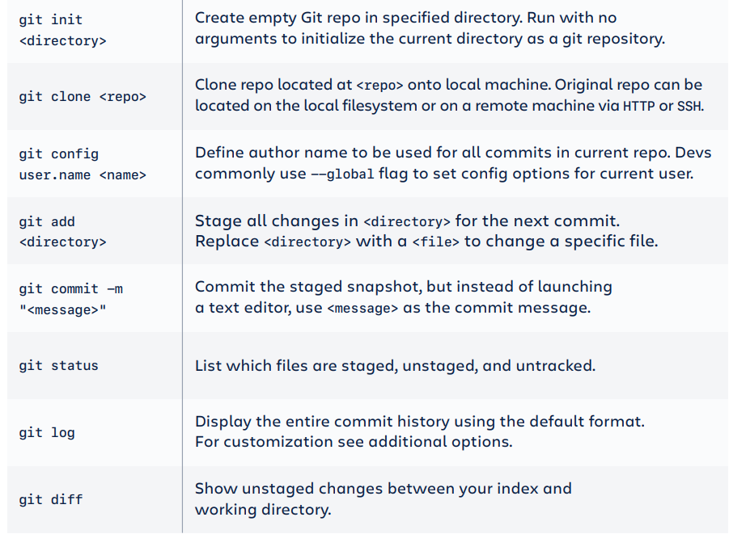
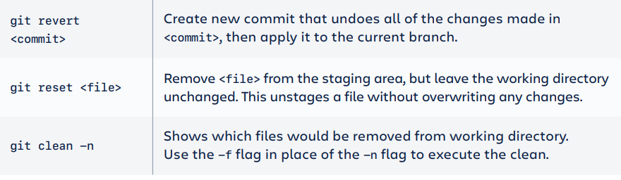
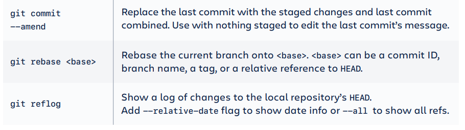
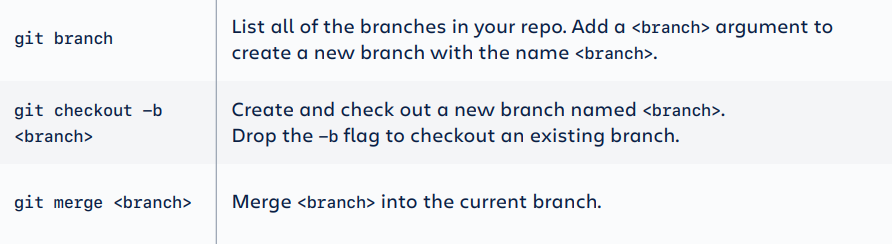

# Git-cheat-sheet
### Handy git cheat sheet guide to enhance your workflow.**
##### Use this handy git cheat sheet guide to enhance your workflow. This Git cheat sheet saves you time when you just can't remember what a command is or don't want to use git help in the command line. It is hard to memorize all the important Git commands by heart. I’ve included the basic Git commands to help you learn Git, and more advanced concepts around Git branches, remote repositories, undoing changes, and more.

#### GIT BASICS

#### UNDOING CHANGES

#### REWRITING GIT HISTORY

#### GIT BRANCHES

   
